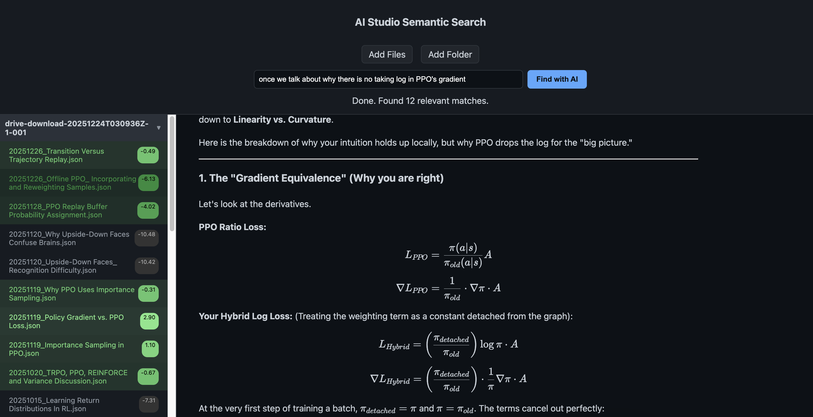

# WheresIt - AI Chat History Semantic Search

**WheresIt** is a lightweight, local-first tool for semantic searching through your AI chat histories (Gemini AI Studio, etc.). It enables you to find specific conversations based on meaning rather than just keywords, all while keeping your data private on your own machine.

---

## 🚀 Quick Start

1. **Download**: Save [wheresit.html](file:///Volumes/data/dev/WheresIt/wheresit.html) to your computer.
2. **Open**: Double-click the file to open it in any modern web browser.
3. **Load**: Click **"Add Files"** or **"Add Folder"** to import your exported chat JSON files.
4. **Search**: Type your query and click **"Find with AI"**.

---

## ✨ Key Features

- **Semantic Search**: Powered by `transformers.js` (MiniLM-L6-v2), allowing you to search by context and intent.
- **Privacy First**: Everything runs locally in your browser. No data is ever sent to a server.
- **Smart Grouping**: Automatically organizes your chats into folders based on your local directory structure.
- **Rich Rendering**: Full support for Markdown, LaTeX (math equations), and syntax highlighting for code blocks.
- **Visual Feedback**: Real-time progress bar during model download and scanning.

---

## 📸 Screenshots

### UI Overview

*(Placeholder: Upload a screenshot showing the main interface with loaded files and search results)*

### How to Export from Google AI Studio
1. Open [Google Drive](https://drive.google.com/), in "My Drive", click "Google AI Studio", you will see your chat history..
2. click start item and then "shift click" the end item, you will select all the items in between.
3. Click "download" icon to download.

---

## 🛠️ How it Works

WheresIt uses **MiniLM-L6-v2**, a powerful cross-encoder model, to rank your conversations based on relevance to your search query. 

- **Local Execution**: The model is downloaded once to your browser's cache and performs all computations locally.
- **Hybrid Context**: The tool scans a context window from each chat to determine relevance, ensuring accurate matches even for long conversations.
- **Match Scores**: Results are ranked with a visual "confidence" score, making it easy to spot the best matches.

---

## 🔜 Roadmap

- [ ] **Qwen History Export**: A utility to convert Qwen chat exports into the Google AI Studio format compatible with WheresIt.
- [ ] **Performance Optimization**: Even faster scanning for very large libraries.
- [ ] **Saved Searches**: Bookmarking important filters or queries.

---

## ⚖️ License

MIT License. Feel free to use and modify for your own needs.
